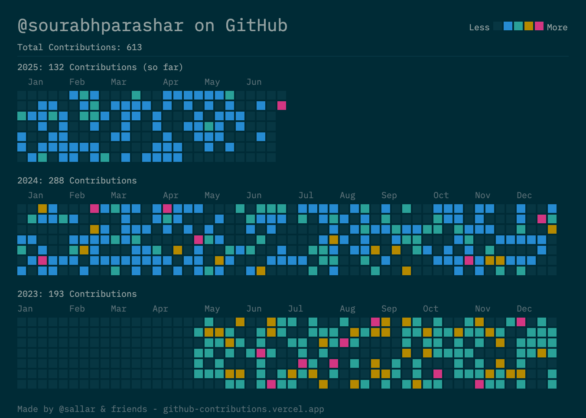

# 💫 About Me:
Hi, I’m a Data Engineer with 6+ years of experience turning messy data into clean, useful insights—kind of like a digital janitor with a love for Python and SQL.  I build pipelines that don’t leak, optimize queries like they owe me money, and wrangle data from all kinds of wild sources. Whether it's ETL, ELT, or just making dashboards behave, I’m your go-to problem solver. My toolbox? Spark, Airflow, AWS, Azure, Docker, a bit of sarcasm, and a strong coffee habit.  I enjoy making complex systems run smoothly and explaining things without buzzwords (unless absolutely necessary). When I’m not coding, you’ll find me automating something I was too lazy to do twice. Always down to chat, debug, or brainstorm the next data-powered idea.   A small toast to every data pipeline that didn’t break on Monday morning.

## 🌐 Socials:
  

# 💻 Tech Stack:
                                   

## 🌐 Personal Portfolio

Check out my full portfolio here:  
🔗 [sourabhparashar430.wixsite.com](https://sourabhparashar430.wixsite.com/site)

## 📊 Data Engineering Highlights

- Built scalable ETL pipelines processing millions of records daily using Apache Spark and Airflow  
- Designed and optimized SQL queries reducing reporting time by 40%  
- Managed cloud data infrastructure on AWS, Azure, and Google Cloud Platform  
- Experienced with real-time streaming using Kafka and data warehousing in Snowflake  
- Automated monitoring dashboards with Datadog and Python

## 📁 Featured Projects

- [Project Portfolio](https://sourabhparashar430.wixsite.com/site/s-projects-basic) – Four data engineering projects demonstrating ETL pipelines, streaming, data warehouses, and dashboards.

### ✍️ Random Dev Quote

